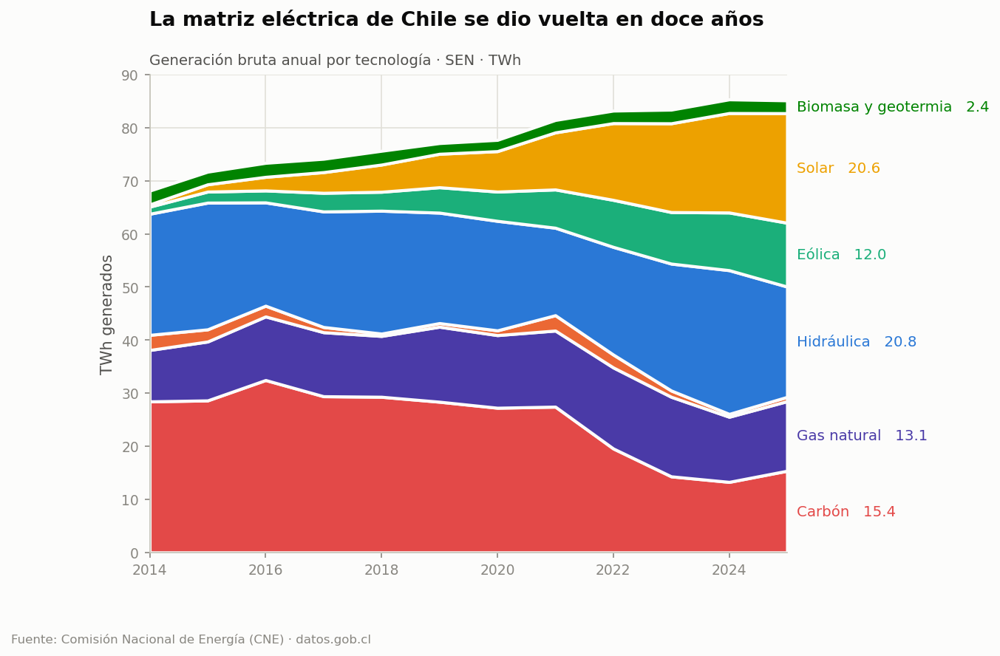
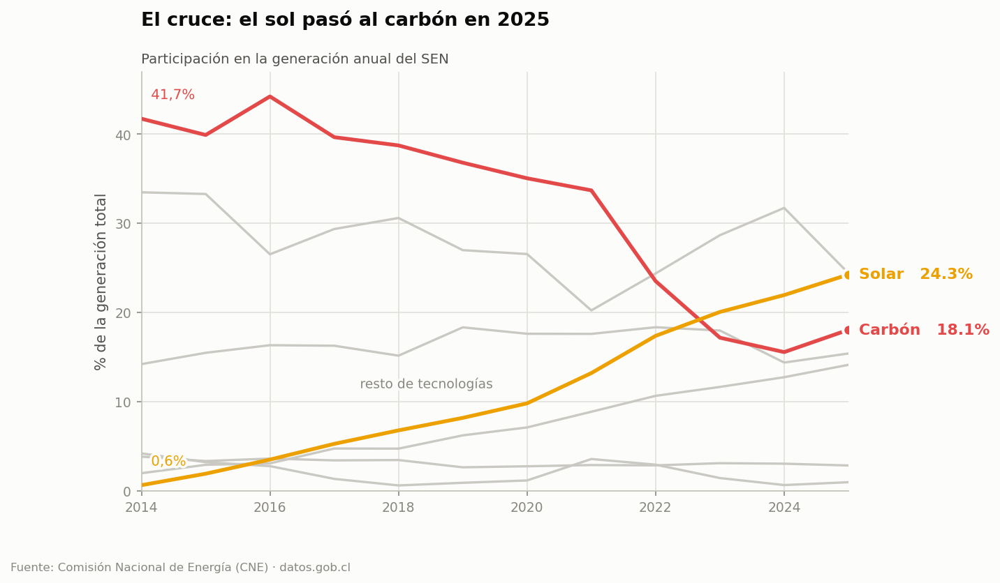
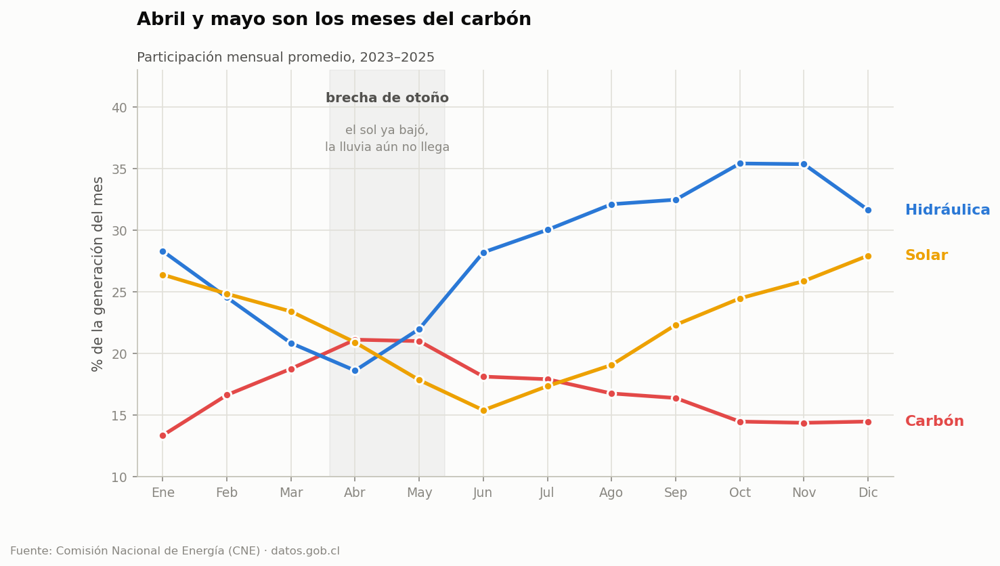
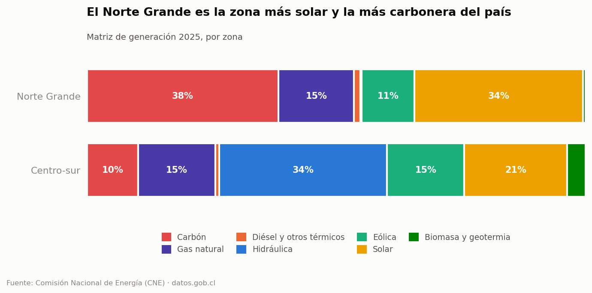

# ¿Cómo dejó Chile de quemar carbón?

Análisis exploratorio de la matriz de generación eléctrica del Sistema Eléctrico
Nacional (SEN), 2014–2025, con datos oficiales de la Comisión Nacional de
Energía.

> **Pregunta guía:** ¿la transición energética chilena está terminada, o el país
> solo movió el problema de lugar?



---

## Hallazgos

**1. El desplazamiento del carbón es real y es rápido.**
La generación fósil cayó de **60,1% a 34,4%** del total entre 2014 y 2025. El
carbón solo pasó de 41,7% a 18,1%.

**2. No ocurrió porque bajara la demanda.**
La generación total *creció* 25% en el período (68,1 → 85,1 TWh). Solar y eólica
aportaron 30,9 TWh nuevos, casi el doble de lo que creció la demanda (17,0 TWh).
El excedente —13,9 TWh— es casi exactamente lo que dejó de generar el carbón
(13,1 TWh). Es sustitución, no contabilidad creativa.

**3. Pero 2025 retrocedió.**
El carbón subió 2,5 puntos en un solo año, su primera alza desde 2021, cuando la
hidrología falló y alguien tuvo que cubrir.



**4. El problema ya no es de generación, sino de sincronía.** Hay dos brechas:

*Temporal* — el carbón toca su máximo en abril–mayo (21,1% del mes), justo
cuando el sol ya bajó y la lluvia todavía no llega. Ocho semanas al año definen
el resultado anual.



*Geográfica* — el Norte Grande es a la vez la zona **más solar (33,8%)** y la
**más carbonera (38,4%)** del país. No es una paradoja: no tiene hidroelectricidad
que le sirva de respaldo (0,3%) y su demanda minera no se apaga de noche.



**Conclusión:** ambas brechas apuntan al mismo lugar. Lo que falta no son más
paneles, sino **almacenamiento y transmisión**.

---

## Reproducir el análisis

```bash
git clone https://github.com/<tu-usuario>/eda-transicion-energetica-chile.git
cd eda-transicion-energetica-chile

python -m venv .venv && source .venv/bin/activate
pip install -r requirements.txt

python src/download.py          # descarga el CSV desde datos.gob.cl (~6,5 MB)
jupyter lab notebooks/01_transicion_energetica_chile.ipynb
```

El notebook descarga los datos por sí solo si no los encuentra. No requiere API
key ni registro.

---

## Estructura

```
├── notebooks/
│   └── 01_transicion_energetica_chile.ipynb   ← el análisis
├── src/
│   ├── download.py     descarga reproducible desde datos.gob.cl
│   ├── clean.py        limpieza y agrupación de tecnologías
│   └── viz_style.py    paleta y estilo de los gráficos
├── figures/            gráficos exportados
└── data/               (no versionado — se regenera con download.py)
```

---

## Los datos

**Fuente:** [Generación Bruta Mensual SEN](https://datos.gob.cl/dataset/generacion-bruta)
— Comisión Nacional de Energía, vía el Portal de Datos Abiertos del Estado de
Chile.

91.538 registros: generación mensual en MWh por central, tecnología y
subsistema, desde enero de 2014.

### Limpieza

El archivo se ve impecable —cero nulos— y no lo está. El notebook documenta
cuatro problemas y el criterio usado en cada uno:

| Problema | Criterio |
|---|---|
| BOM UTF-8 y coma decimal | `encoding="utf-8-sig", decimal=","` |
| Ruido de punto flotante (`11843.1000000001`) | redondeo a 0,1 MWh |
| 652 filas repetidas desde 2022-03 | **se suman**, no se eliminan |
| Un valor negativo (−3,16 MWh) | se lleva a 0 |

El tercero es el que más importa. Las filas repetidas no son duplicados: a
partir de marzo de 2022 la CNE empezó a reportar las *unidades generadoras* de
una misma central por separado, manteniendo el mismo `codigo_central`.
Eliminarlas produciría una caída falsa de 1,1% en la generación nacional, con un
escalón artificial justo en ese mes. El notebook incluye la prueba que lo
demuestra.

### Límites

- Los datos son **mensuales**. La brecha de otoño se ve; la curva diaria —donde
  vive el problema real del almacenamiento— no.
- `subsistema` (SIC/SING) es una etiqueta **histórica**: ambos sistemas se
  interconectaron en el SEN en noviembre de 2017. Se usa como proxy geográfico
  estable, no como descripción de la operación actual.
- El dataset mide **generación**, no capacidad instalada ni vertimiento
  (*curtailment*). No permite cuantificar cuánta energía solar se descartó por
  falta de transmisión — la continuación natural de este análisis.
- 2026 está incompleto (enero y febrero) y queda fuera de toda comparación anual.

---

## Nota sobre los gráficos

La paleta está ordenada para que cualquier par de series **adyacentes** en un
apilado siga siendo distinguible con daltonismo (protanopía, deuteranopía,
tritanopía), verificado con el criterio ΔE en espacio OKLab: ≥8 bajo simulación
de daltonismo y ≥15 con visión normal. Las series de bajo contraste llevan
etiquetas directas además de leyenda, y el notebook incluye la tabla completa
para que la lectura nunca dependa solo del color.
